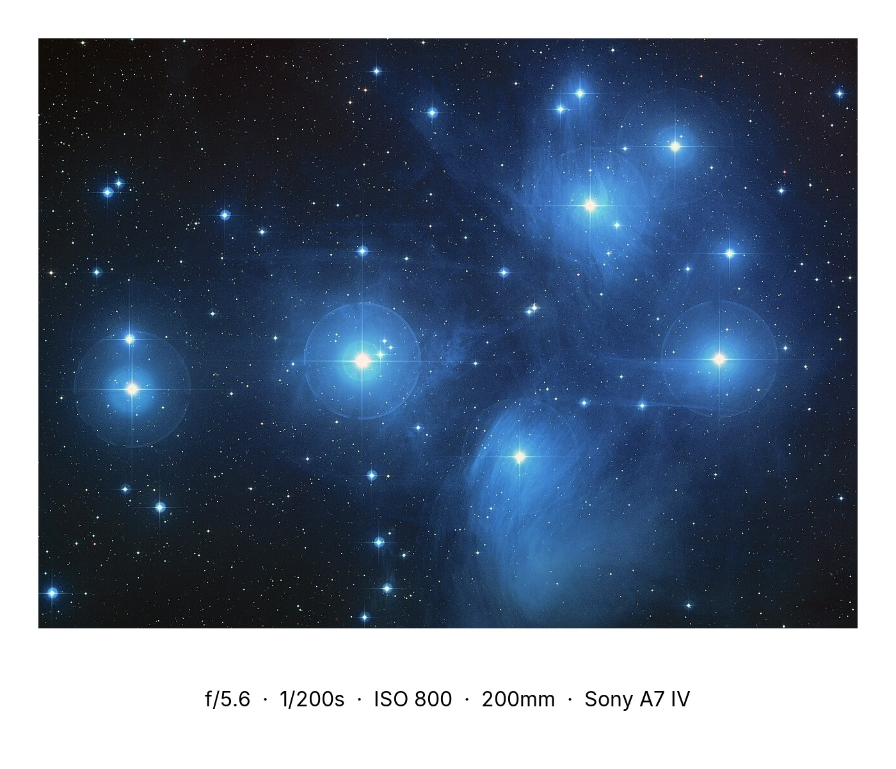

# frame_tool

[](https://github.com/emihrem/frame-tool/actions/workflows/ci.yml)
[](https://codecov.io/gh/emihrem/frame-tool)
[](https://www.python.org/downloads/)
[](https://github.com/astral-sh/ruff)
[](https://mypy-lang.org/)
[](LICENSE)

Add white or black borders to JPG photos and stamp them with EXIF metadata (aperture, shutter speed, ISO). Cross-platform (macOS / Linux / Windows) with a modern dark GUI and a CLI for batch processing.

## Before · After

| Original from camera | Framed with EXIF |
|:--:|:--:|
|  |  |

*Sample photo: NASA / Hubble Pleiades, public domain. Borders, layout, and EXIF text added by `frame_tool` — the original pixels are untouched.*

Built for photographers who edit in Lightroom and want a simple post-export step to add borders + shooting info — without ever touching the underlying JPEG quality.

## Features

- Independent border per side (top, bottom, left, right), white or black.
- Optional EXIF overlay with configurable position, font family (Montserrat / Inter / Lora), size, and fields (f-stop, shutter, ISO, focal length, camera).
- **Instagram-friendly export**: pad to 1:1, 4:5, 1.91:1, or 9:16 so IG doesn't crop your composition (or `auto` per orientation).
- Live preview as you tweak settings.
- Batch export an entire folder with one click (or one CLI command).
- Original JPEG quality and EXIF metadata preserved on export (`quality="keep"`, `subsampling="keep"`).
- Three typefaces bundled (Montserrat / Inter / Lora) — same look on every OS.
- Background check for new releases on launch (opt-out with `FRAME_TOOL_NO_UPDATE_CHECK=1`).

## Install (recommended: `uv`)

```bash
# Install once, isolated, with auto-managed Python:
uv tool install --from . frame-tool

# Or, from a git remote later:
# uv tool install git+https://github.com/<you>/frame-tool
```

Then run from any directory:

```bash
frame-tool          # launches GUI
frame-tool gui      # explicit GUI launch
frame-tool --help   # CLI help
```

### Development setup

```bash
cd frame_tool
uv venv
source .venv/bin/activate     # Windows: .venv\Scripts\activate
uv pip install -e .
frame-tool
```

### Alternative: pipx

```bash
pipx install .
```

## GUI usage

1. Click **Open folder** and select a folder of JPGs.
2. Adjust border thickness per side, color, metadata position, font size, and fields.
3. Use ◀ / ▶ to flip through images and preview each one with the same settings.
4. Click **Export all** and pick an output folder (defaults to `<input>/framed/`).

## CLI usage

```bash
frame-tool process ./photos \
  --top 50 --bottom 240 --left 50 --right 50 \
  --color white \
  --metadata-position bottom-center \
  --font-size 36 \
  --focal-length \
  --output ./photos/framed
```

Flags:

| Flag | Default | Description |
|---|---|---|
| `--top / --bottom / --left / --right` | `50 / 200 / 50 / 50` | Border in px |
| `--color` | `white` | `white` or `black` |
| `--metadata-position` | `bottom-center` | `bottom-center`, `bottom-left`, `bottom-right`, `top-center`, `top-left`, `top-right` |
| `--font` | `montserrat` | `montserrat`, `inter`, `lora` |
| `--font-size` | `36` | Metadata font size in px |
| `--no-metadata` | off | Disable text overlay entirely |
| `--no-aperture / --no-shutter / --no-iso` | shown | Hide a field |
| `--focal-length / --camera-model` | hidden | Include a field |
| `--caption "© Emi"` | `""` | Free-text rendered in the border |
| `--caption-position` | `bottom-left` | Same six positions as `--metadata-position` |
| `--caption-font / --caption-font-size` | `montserrat` / `28` | Caption typeface and size |
| `--watermark PATH` | _(off)_ | PNG with transparency, composited inside the frame |
| `--watermark-position` | `bottom-right` | Where the logo sits |
| `--watermark-opacity` | `1.0` | 0.0–1.0 |
| `--watermark-size` | `0.1` | Logo width as fraction of the canvas long edge |
| `--instagram` | `none` | `none`, `auto`, `square`, `portrait`, `landscape`, `story` |
| `--instagram-size` | _(off)_ | Downscale long edge to this many px (e.g. `1080`) |
| `--preset NAME` | _(off)_ | Load a saved preset; overrides all other render flags |
| `--output / -o` | `<input>/framed` | Output folder |

Output filenames are `<original>_framed.jpg`.

### Instagram example

```bash
# Pad every image to 4:5 (Instagram portrait) without cropping, keep full resolution
frame-tool process ./photos --instagram portrait --color white

# Same but downscaled to Instagram's exact 1080 long-edge canvas
frame-tool process ./photos --instagram portrait --instagram-size 1080

# Let frame_tool pick the best preset based on each image's orientation
frame-tool process ./photos --instagram auto
```

The tool **never crops** — it adds extra border in the chosen colour on the two sides needed to reach the target ratio. Instagram does its own downscale on upload; `--instagram-size 1080` only matters if you want the exported file to already match.

### Presets

Saved settings live in `~/.frame_tool/presets.json` (created on first save).

```bash
# Save the current flag set under a name
frame-tool save-preset wedding \
  --color cream --top 60 --bottom 240 \
  --caption "© 2026 Emi Mer" --caption-position bottom-right

# List what you've saved
frame-tool list-presets

# Re-use it on any folder — preset overrides every other render flag
frame-tool process ./trip --preset wedding

# Remove
frame-tool delete-preset wedding
```

In the GUI: top-bar **Preset** dropdown + **Save** / **Delete** buttons. Saving prompts for a name; selecting a saved preset pushes every value into the controls in one shot.

## Build a standalone app (double-click, no terminal)

You can package frame_tool as a native app — `.app` on macOS, `.exe` folder on Windows, executable folder on Linux. End users don't need Python.

```bash
# In the project root, with the venv activated:
uv pip install -e ".[build]"
pyinstaller packaging/frame_tool.spec --noconfirm --clean
```

Output:

- **macOS**: `dist/frame_tool.app` (~120 MB). Drag it to `/Applications` and launch with double-click.
- **Linux / Windows**: `dist/frame_tool/` folder. Run `frame_tool` (or `frame_tool.exe`).

The bundle includes Python, PySide6/Qt, Pillow, the Inter font, and the QSS theme — fully self-contained.

> **macOS note**: the build is unsigned, so the first launch will trigger Gatekeeper. Right-click the app → *Open* → *Open* (only needed once). For distribution to others, sign and notarize with `codesign` + `notarytool`.
>
> Each OS produces its own bundle — you can't build a Windows `.exe` from macOS. Build on the target platform (or via CI on a matrix runner).

## Development

```bash
uv venv && source .venv/bin/activate
uv pip install -e ".[dev]"
pre-commit install
```

Quality gates run in CI on every push and PR:

```bash
ruff check .          # lint
ruff format --check . # format
mypy                  # type check
pytest --cov          # tests + coverage
```

## Tech stack

- **Pillow** for image processing, EXIF, and text rendering.
- **Pydantic v2** for typed configuration models.
- **PySide6 (Qt)** for the GUI.
- **Typer** for the CLI.
- **uv** + **hatchling** for packaging.

## License

MIT. Bundled fonts (all under SIL Open Font License 1.1):

- [Montserrat](https://github.com/JulietaUla/Montserrat) by Julieta Ulanovsky
- [Inter](https://github.com/rsms/inter) by Rasmus Andersson
- [Lora](https://github.com/cyrealtype/Lora-Cyrillic) by Cyreal

License files live next to each font in `src/frame_tool/assets/fonts/`.
